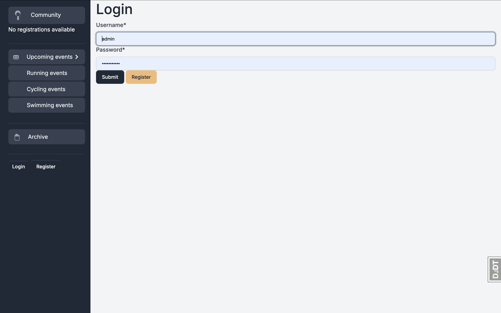
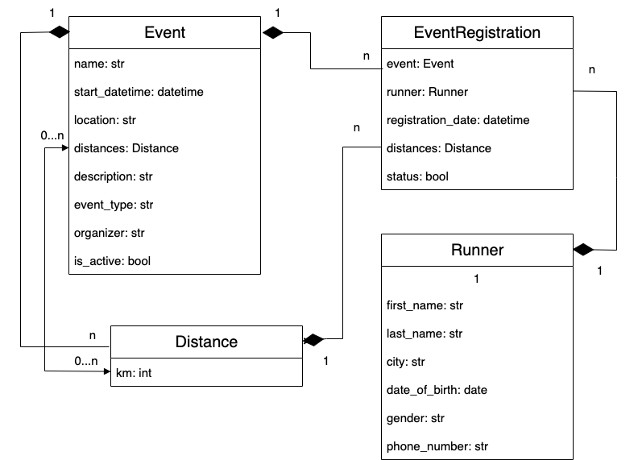

# Event Community Project

Connect and register for running, cycling, and swimming events!

## Project Description

Event Community is a versatile platform designed for organizing and participating in running, cycling, and swimming events. Event organizers can easily create, edit, and manage events through an admin panel, while users can register, maintain their profiles, explore upcoming events, and track their past activities. This app brings together a vibrant community of fitness enthusiasts, making it easier than ever to connect, participate, and stay updated on various sports events.

## Features

* **Event Management**: Organizers can create, edit, and delete running, cycling, and swimming events through an easy-to-use admin interface.
* **User Registration and Profile Management**: Users can register, view, edit, and delete their profiles seamlessly.
* **Manage Registrations**: Users can view and edit their event registrations and see a list of all their registered events.
* **Explore Events**: Browse upcoming events by type, search by location or city, and view detailed information about each event.
* **Participant Information**: View a list of all registered users, detailed information about them, and their event participation history.
* **Archive of Past Events**: Access an archive of past events to track previous activities and event history.
* **Admin Controls**: Administrators can manage users, create, edit, and delete events, and maintain the overall platform.
* **Enhanced Search Functionality**: Perform advanced searches for events based on various criteria like location, city, and event type.
* **User-Friendly Interface**: Simple and intuitive interface for both users and administrators to navigate and manage activities effortlessly.
* **Community Building**: Connect with other participants, share experiences, and grow together as a community centered around fitness and sports activities.



## Technological Stack

* **Backend**: Django
* **Frontend**: HTML, CSS, JavaScript
* **Database**: SQLite
* **Environment Management**: Python Virtual Environment (venv)
* **Version Control**: Git, GitHub

## Check it out!
[Event Community project deployed to Render](https://event-community.onrender.com/)

Use the login and password of the administrator and the test user for the test site:

login:admin
password:1qazcde3

login:test_user
password:1qazcde3

## Installation Instructions

Follow these steps to set up the project locally:

1. **Clone the repository:**
    ```shell
    git clone https://github.com/Viesich/event_community.git
    cd event_community
    ```

2. **Set up a virtual environment:**
    ```shell
    python3 -m venv venv
    source venv/bin/activate  # For Unix or MacOS
    venv\Scripts\activate  # For Windows
    ```

3. **Install the required packages:**
    ```shell
    pip install -r requirements.txt
    ```

4. **Run the server:**
    ```shell
    python manage.py runserver  # Starts the Django server
    ```

## Database Schema

Below is a simplified representation of the database schema:


```plaintext
Runner
- id (Primary Key)
- first_name
- last_name
- city
- date_of_birth
- gender
- phone_number

Event
- id (Primary Key)
- name
- start_datetime
- location
- distances
- description
- event_type
- organiser
- is_active

Distance
- id (Primary Key)
- km

Registration
- id (Primary Key)
- event (Foreign Key to Event)
- runner (Foreign Key to Runner)
- registration_date
- distances (Foreign Key to Distance)
- status
